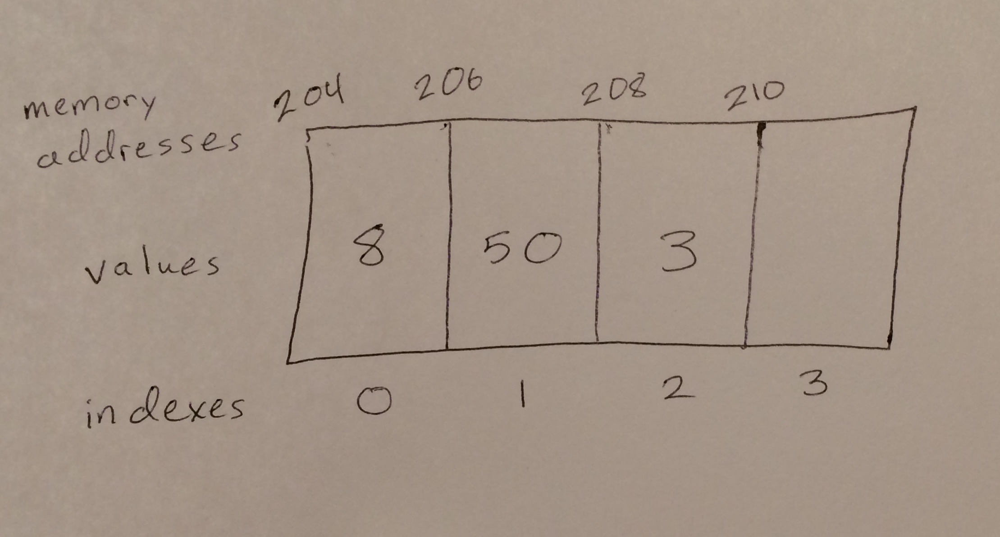

# Array

An array is a fixed row of pieces of memory that all have their memory addresses in order. An array will often store a pointer of its first memory address that does not have a variable located at it. If an array is dynamic, that means that when its slots in memory are all in use and it needs room for more variables, it automatically makes a copy of itself twice as large in memory (with all its data stored in the first half of its new slots in memory), then deletes its original self.

# In Memory

In memory, an array looks like this:



The rectangles represent pieces of memory.

# Operations

An array supports the following operations:

* **Access** returns a variable stored in the specified index (location in the array) in O(1) constant time. It always takes the same amount of time to access an element of an array because an array's first memory address is always stored and the following memory addresses are all in order. The index passed to the access function is multiplied by the size of the data type making up the array elements, then added to the base memory address. This tells the computer exactly where to look in memory to find the specified element of the array and always takes the same amount of computing.
* **Search** looks through every element to see if the specified variable value is stored in the array in O(n) linear time. For every variable added to an array, the search function must look through one more variable; the amount of time it takes to search an array increases linearly as new variables are added.
* **Insertion** puts a new variable into a specified location in an array, moving over any variables in the way; this happens in O(n) linear time. Having to move over all the variables that come after the point where one variable must be inserted causes the time insertions take to correlate directly with how many variables there are following the point of insertion.
* **Deletion** removes a variable at a specified location and moves all the following variables over to fill in the gap. This takes O(n) linear time because, like with insertions, the amount of time a deletion takes correlates directly with an arbitrary number of variables that have to move over.


# Use Cases

An array is useful when stored variables need to be accessed quickly because array access operations occur in constant time.

It is not useful when variables need to be searched for, inserted, or deleted quickly: all these operations occur in linear time.

# Example

```
my_array = [1, 2, 3, 4, 5]
accessed_variable = my_array[0]
variable_in_array = 4 in my_array
my_array.insert(2, 3)
del my_array[3]
```

(c) 2018 Amber Kolar. All rights reserved.