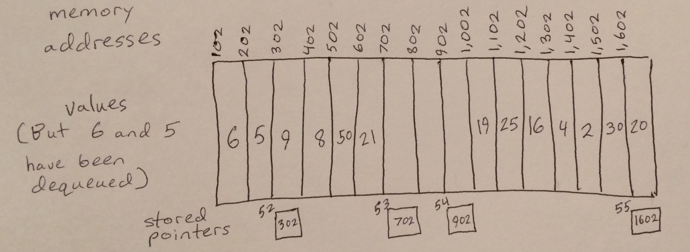

# Deque

A deque is a dynamic row of pieces of memory that all have their memory addresses in order. In a deque, variables can be put in on both ends and tracked by pointers. The variables on the very ends can then be removed.

# In Memory

In memory, a deque looks like this:



The rectangles represent pieces of memory. The two pointers in the middle are keeping track of where enqueuing can occur on each of the two halves of the deque. The pointers closer to the edges are keeping track of where dequeuing can occur for each of the two halves of the deque. Values outside these pointers near the edges have already been dequeued and are no longer part of the deque.

# Operations

A deque supports the following operations:

* **Enqueue Front** is an O(1) constant time operation that puts a variable at the first open memory address that presents itself when a deque is viewed from front to back. The operation is constant time because there is always a stored pointer directing the computer straight to this open memory address.
* **Dequeue Front** also works in O(1) constant time, but it increments a front end pointer to remove a variable from the front end of the deque; it then returns the removed variable. Dequeue front is able to work in constant time thanks to the stored pointer that always points to the current front end of the deque.
* **Enqueue Back** is an O(1) constant time operation that puts a variable at the first open memory address that presents itself when a deque is viewed from back to front. The operation is constant time because there is always a stored pointer directing the computer straight to this open memory address.
* **Dequeue Back** also works in O(1) constant time, but it decrements a back end pointer to remove a variable from the back end of the deque; it then returns the removed variable. Dequeue back is able to work in constant time thanks to the stored pointer that always points to the current back end of the deque.

# Use Cases

A deque is useful when data needs to enter a structure to wait in line to be used and there are two ways of handling data at the front of the line. The design of the operations naturally lends itself to processes where data must wait in two first-in-first-out lines for use, and the O(1) constant time operation speeds of these operations make them especially attractive in such situations.

Deques are not useful when data needs to be accessed in any order other than a doubled up first-in-first-out order. They do not have the operations that make it possible to access data other than whatever variables were enqueued on the two sides first.

# Example

```
my_deque = deque()
my_deque.enqueue_front(1)
my_deque.enqueue_back(2)
first_in_front = my_deque.dequeue_front()
first_in_back = my_deque.dequeue_back()
```

(c) 2018 Amber Kolar. All rights reserved.