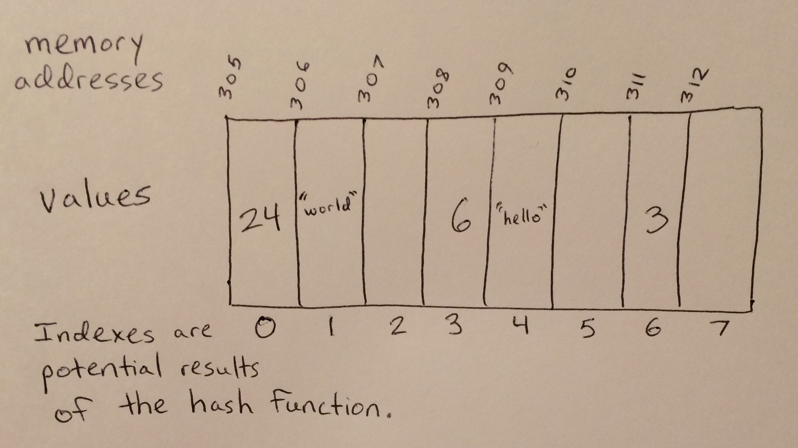

# Dictionary/Hash Table

Dictionaries and hash tables are collections of points in memory that can be given variables and found using keys. Every variable stored in a dictionary or hash table must have a key stored for it. When passed a key, a dictionary or hash table will put the key through a hash function to turn it into a number associated with a memory address, the memory address where the associated variable will be stored.

# In Memory

In memory, a dictionary looks like this:



The rectangles represent pieces of memory. The stored values have a mixed up order within their dictionary because they had their positions decided by a hash function.

# Operations

A dictionary and a hash table support the following operations:

* **Access** returns a variable associated with the key that was passed in O(n) constant time. This operation always takes the same amount of time because when a key is passed to a dictionary or hash table, the key is put into a hash function. A hash function uses the key to determine a specific number, a number that will always be associated with one of the dictionary's memory addresses. A key's memory address is where the variable associated with the key is stored.
* **Search** looks through every key in a dictionary or hash table to see if the specified key is present. This happens in O(n) linear time because the amount of time it takes to search through (at most) every key stored in the dictionary or hash table depends directly on how many keys there are to look over.
* **Insertion** stores a new key and its associated variable in the referenced dictionary or hash table in O(n) linear time. It takes this long because the function has to go through all the current keys to find the first available place for the new key; there can be any number of keys to go through.
* **Deletion** removes a key and its value from a dictionary or hash table in O(n) linear time. This happens in linear time because every key after the one that gets removed has to be moved over to fill in the newly-created gap. The number of keys to move can become arbitrarily large.

# Use Cases

A dictionary and a hash table are useful for any situation when there is a need to enter pieces of data (keys) that can quickly pull up specific, correlated pieces of data. This is thanks to the constant time speed of dictionary and hash table access functions as well as the key-and-value pairs stored in this data structure.

It is not useful when the data in use does not naturally lend itself to being paired up as keys with values or when there is a need to quickly search, insert, or delete many data points. This is because a dictionary and hash table must always have paired-up data by definition, and because the algorithmic complexity of functions other than accessing ones take linear time with this data structure.

# Example

```
my_dictionary = {'a':12, 'b':8, 'c':10, 'd':65, 'e':0}
accessed_variable = my_dictionary['b']
key_in_dictionary = 'c' in my_dictionary
my_dictionary['f'] = 50
del my_dictionary['b']
```

(c) 2018 Amber Kolar. All rights reserved.