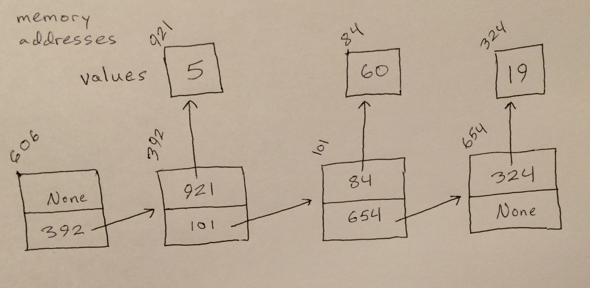

# Linked List

A singly-linked list is implemented as a node with two pointers, one that points to a variable in memory and another that points to the following linked list node. Whole singly-linked lists can be made up of any number of nodes. The first node (the sentinel) will have nothing pointing to it, while each other node will have one node pointing to it. The end node will not point to anything. Doubly-linked lists are nearly the same as singly-linked lists, but each node in a doubly-linked list has a pointer pointing back at the node before it. Linked lists that loop have a sentinel node and an end node that point to one another. Often, a linked list's sentinel node will be the one node that does not store a value other than its pointers.

# In Memory

In memory, a linked list looks like this:



The rectangles represent pieces of memory and the arrows represent pointers. This particular linked list is singly-linked and does not loop. Note that linked lists can store their values directly within their main nodes; they do not have to use pointers to their values like they do in this image.

# Operations

A linked list supports the following operations:

* **Access** uses the number it is passed to start at the sentinel and count out nodes away from the sentinel and until it is a distance from the sentinel that corresponds with the passed number. It then returns the value stored at the node which was landed on. This operation happens in O(n) linear time because it must recurse or loop over an arbitrary number of nodes until it reaches its specified destination; the number of nodes that must be passed over directly impacts how long the operation takes to complete.
* **Search** starts at the sentinel and recurses or loops through the nodes that follow until it reaches a node with the specified value or the end of the linked list. Search takes an O(n) linear amount of time to complete because—like access—it could have to pass over any number of nodes before finishing.
* **Insertion** puts a node into a linked list by redirecting the pointers of the nodes on either side of its new location to point to this new node instead of each other. Insertion then redirects the pointers of the node being inserted so that it points back at the nodes it is being linked to. This all happens in O(1) constant time because no matter where a node is being inserted, the same number of pointers will be redirected. However, an O(n) search is sometimes needed in order to find the right place to insert a node. 
* **Removal** deletes a specified node from a linked list by redirecting the pointers of the nodes on either side of it so that these nodes point to each other instead of pointing to the specified node. This happens in O(1) constant time because no matter where a node is being removed, the same number of pointers will be redirected. However, an O(n) search is sometimes needed in order to find the right place to remove a node.

# Use Cases

A linked list is useful when a set of data is constantly having variables inserted and deleted at various locations because linked lists have fast, O(1) insertions and removals.

Linked lists are not useful when data needs to be quickly accessed or searched for because they have O(n) access and search operations.

# Example

```
my_linked_list = linked_list()
node_2 = linked_list(10)
node_3 = linked_list(5)
my_linked_list.insert(node_2)
my_linked_list.insert(node_3)
second_node_value = my_linked_list.get_next().get_data()
contains_10 = my_linked_list.search(10)
my_linked_list.remove(5)
```

(c) 2018 Amber Kolar. All rights reserved.