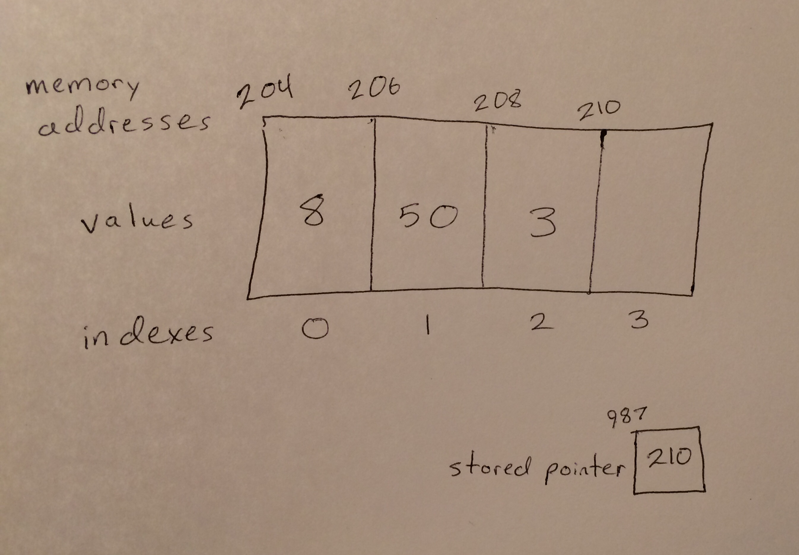

# Python List

A python list is a row of pieces of memory that all have their memory addresses in order. A python list stores a pointer of its first memory address that does not have a variable located at it. When a python list's slots in memory are all in use and it needs room for more variables, it automatically makes a copy of itself twice as large in memory (with all its data stored in the first half of its new slots in memory), then deletes its original self.

# In Memory

In memory, a python list looks like this:



The rectangles represent pieces of memory. The pointer down below is keeping track of where the next available spot in the python list is.

# Operations

A python list supports the following operations:

* **Access** returns a variable stored in the specified index (location in the python list) in O(1) constant time. It always takes the same amount of time to access an element of a python list because a python list's first memory address is always stored and the following memory addresses are all in order. The index passed to the access function is multiplied by the size of the pointers contained by the python list, then added to the base memory address. This tells the computer exactly where to look in memory to find the specified element of the python list and always takes the same amount of computing.
* **Search** looks through every element to see if the specified variable value is stored in the python list in O(n) linear time. For every variable added to a python list, the search function must look through one more variable; the amount of time it takes to search a python list increases linearly as new variables are added.
* **Insertion** puts a new variable into a specified location in a python list, moving over any variables in the way; this happens in O(n) linear time. Having to move over all the variables that come after the point where one variable must be inserted causes the time insertions take to correlate directly with how many variables there are following the point of insertion.
* **Deletion** removes a variable at a specified location and moves all the following variables over to fill in the gap. This takes O(n) linear time because, like with insertions, the amount of time a deletion takes correlates directly with an arbitrary number of variables that have to move over.
* **Append** uses a pointer to the end of the python list to add a new variable to the very end of the python list in O(1) time. This always takes the same amount of time because there is always a pointer that leads straight to the end of the python list, regardless of how many variables are in the python list.
* **Pop** uses the same pointer as append to remove a variable from the end of a python list and return it in O(1) time. This always takes the same amount of time for the same reason that appending always takes the same amount of time.

# Use Cases

A python list is useful when stored variables need to be accessed quickly because python list access operations occur in constant time.

It is not useful when variables need to be searched for, inserted, or deleted quickly: all these operations occur in linear time.

# Example

```
my_python_list = [1, 2, 3, 4, 5]
accessed_variable = my_python_list[0]
variable_in_python_list = 4 in my_python_list
my_python_list.insert(2, 3)
del my_python_list[3]
my_python_list.append(1)
popped variable = my_python_list.pop()
```

(c) 2018 Amber Kolar. All rights reserved.