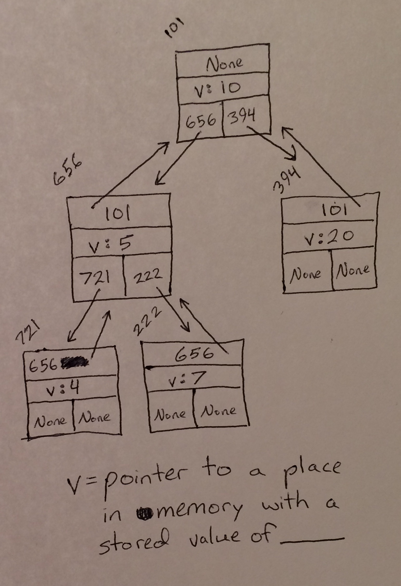

# Tree Overview

A tree is implemented as a node with usually at least three pointers. One pointer points to a point in memory for a variable to be stored at, one points to the node's parent (the node above it in the tree) if it has one (meaning that it is not the root node), and other pointers point to children of the node (nodes below the current one in the tree) if it has any (meaning that it is not a leaf node).

# The Binary Search Tree (BST)

A BST is a type of tree that is usually implemented as a node with four pointers. One pointer points to a spot in memory for a variable to be stored at, one points to the node's parent if it is not the root node, and other two pointers point to the left and right children of the node (which it may have one or both of) if it is not a leaf node. BSTs have their nodes organized so that nodes storing smaller variables become children on the left and nodes storing larger variables become children on the right. A BST is described in further detail below.

# In Memory

In memory, a tree looks like this:



The rectangles represent pieces of memory and the arrows represent pointers. Note that BSTs can also store their values directly within their main nodes; they do not have to use pointers to their values like they do in this image.

# Operations

A tree supports the following operations:

* **Access** starts at the root and traverses down through the nodes until the node that needs to be accessed is reached, at which point that node's value is returned. When the BST is balanced (meaning that all the branches of nodes in the tree have heights no more than one level apart), this process occurs in O(log(n)) logarithmic time. This is because every time the operation moves down from a balanced BST node to one of its children, the number of remaining children to navigate is cut in half. However, if a BST is so unbalanced that all its nodes are lined up in a row like a linked list, this speed is lost. Navigating a linked list occurs in O(n) linear time.
* **Find** starts at the root and decides whether it needs to return the current node (which it will do if the current node's value is the value the operation is looking for) or recurse down to the left or to the right. If the operation needs to recurse down, it picks its direction by seeing whether the value being searched for is greater than (which means recurse to the right) or less than (which means recurse to the left) the value of the current node. If no matching node is found, then—in python—find returns a default `None`. This operation works in O(log(n)) logarithmic time when the BST is balanced because, again, the remainder of the BST will be repeatedly split in half as the function recurses. Though, if the BST is so unbalanced that it has degraded into a linked list, the find operation will take just as long as a linked list's searching operation, which occurs in O(n) linear time.
* **Insertion** compares the value of a node that needs to be inserted to the value of the root, then recurses the new node down the BST either to the left (if the new node's value is smaller) or to the right (if the new node's value is larger). This recursion continues until the operation has reached the correct point for the new node to become a leaf at. A pointer of the node's soon-to-be parent is redirected into it—the pointer being either the right or left one, depending on how the new node's value compares to this parent node's value. The new node then has its parent pointer set to its new parent. This all occurs in O(log(n)) logarithmic time when the BST is balanced because the BST is repeatedly split in half during the recursion. If the BST has degraded into a linked list, however, this operation occurs in O(n) linear time because every node must be recursed through.
* **Deletion** must traverse down to the node that needs to be deleted. Once the node is reached, the pointers of nodes connected to it are all rearranged so that the BST's nodes stay in the correct order without including the deleted node anymore. This occurs in O(log(n)) logarithmic time when the BST is balanced because the BST is repeatedly split in half while it is being traversed. If the BST has degraded into a linked list, however, this operation occurs in O(n) linear time because a step down in level does not come close to halfing the overall size of the remaining group of nodes; a step only removes a single node.

# Use Cases

A BST is useful when a program has a lot of data that all needs to be accessed, located, inserted, and deleted, but the program also needs its data to stay ordered. This is because, despite how BSTs can degrade into linked lists, they generally tend to have quick operations and they always keep their data in order.

BSTs are not useful when data does not need to be kept in order. When this is the case, BSTs add in the factor of potentially-degrading speed for no reason.

# Example

```
my_bst = bst(5)
child_1 = bst(1)
child_2 = bst(10)
my_bst.insert(child_1)
my_bst.insert(child_2)
left_child_value = my_bst.get_left().get_data()
contains_10 = my_bst.find(10)
my_bst.delete(my_bst.get_left())
```

(c) 2018 Amber Kolar. All rights reserved.